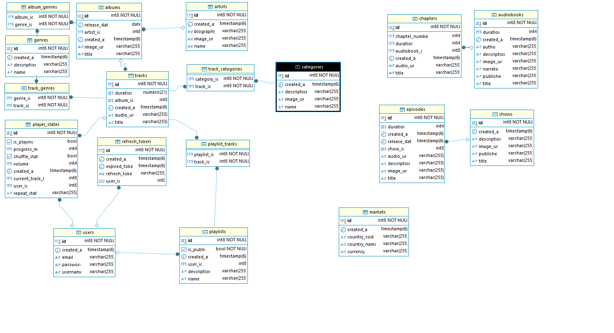

# Sonic Nest API

- Sonic Nest is a comprehensive REST API that mimics core like Spotify functionality, built with Spring Boot. It provides endpoints for managing music tracks, albums, artists, playlists, podcasts and more.

## Database Diagram



## Technologies Used

- Java
- Spring Boot 3
- Spring Security with JWT authentication
- Spring Data JPA
- PostgreSQL as the database
- Lombok for reducing boilerplate code
- Maven for dependency management
- Postman for API testing

## Database Structure

The application models a music streaming platform with the following key entities:

- **User**: Authentication and account information
- **Track**: Music tracks with metadata
- **Album**: Collections of tracks
- **Artist**: Music creators
- **Playlist**: User-created collections of tracks
- **Genre**: Music classifications
- **Category**: Content groupings
- **PlayerState**: User's current playback state
- **Show**: Podcast shows
- **Episode**: Individual podcast episodes
- **Audiobook**: Audio book content
- **Chapter**: Individual chapters of audiobooks
- **Market**: Geographical regions for content availability

## Getting Started

**Prerequisites**

- JDK 17+
- PostgreSQL 12+
- Maven 3.6+ (or use the included Maven wrapper)

## Database Configuration

Default configuration in `application.properties`:

```
spring.datasource.url=
spring.datasource.username=
spring.datasource.password=
spring.jpa.properties.hibernate.default_schema=
spring.jpa.hibernate.ddl-auto=
```

## Running the Application

**Using Maven**:

```
mvn spring-boot:run
```

**Or with the Maven wrapper:**

```
./mvnw spring-boot:run
```

The application will be accessible at `http://localhost:8080`.

## Authentication

The API uses JWT (JSON Web Token) for authentication:

1. Register a new user:

   - POST /api/v1/auth/register

     - Request Body:
       ```
        {
        "username": "user",
        "password": "password"
        }
       ```

2. Login:

   - POST /api/v1/auth/authenticate

     - Request Body:
       ```
        {
        "username": "user",
        "password": "password"
        }
       ```

3. Using the token:

   - Add the header:
     `Authorization: Bearer {access_token}` to all API requests

4. Refresh Token:

   - POST /api/v1/auth/refreshtoken

     - Request Body:
       ```
        {
        "username": "user",
        "password": "password"
        }
       ```

# API Endpoints

### Authentication

- **POST** `/api/v1/auth/register` - Register a new user
- **POST** `/api/v1/auth/authenticate` - Authenticate and get tokens
- **POST** `/api/v1/auth/refreshtoken` - Refresh authentication token

### Tracks

- **GET** `/api/v1/tracks/list` - Get all tracks
- **GET** `/api/v1/tracks/list/{id}` - Get track by ID
- **POST** `/api/v1/tracks/create` - Create a track
- **PUT** `/api/v1/tracks/update/{id}` - Update a track
- **DELETE** `/api/v1/tracks/delete{id}` - Delete a track
- **GET** `/api/v1/tracks/album/{albumId}` - Get tracks by album
- **GET** `/api/v1/tracks/category/{categoryId}` - Get tracks by category
- **POST** `/api/v1/tracks/{trackId}/categories/{categoryId}` - Add category to track
- **DELETE** `/api/v1/tracks/{trackId}/categories/{categoryId}` - Remove category from track
- **GET** `/api/v1/tracks/genre/{genreId}` - Get tracks by genre
- **POST** `/api/v1/tracks/{trackId}/genres/{genreId}` - Add genre to track
- **DELETE** `/api/v1/tracks/{trackId}/genres/{genreId}` - Remove genre from track

### Albums

- **GET** `/api/v1/albums/list` - Get all albums
- **GET** `/api/v1/albums/list/{id}` - Get album by ID
- **POST** `/api/v1/albums/create` - Create an album
- **PUT** `/api/v1/albums/update/{id}` - Update an album
- **DELETE** `/api/v1/albums/delete/{id}` - Delete an album

### Artists

- **GET** `/api/v1/artists/list` - Get all artists
- **GET** `/api/v1/artists/list/{id}` - Get artist by ID
- **POST** `/api/v1/artists/create` - Create an artist
- **PUT** `/api/v1/artists/update/{id}` - Update an artist
- **DELETE** `/api/v1/artists/delete/{id}` - Delete an artist

### Playlists

- **GET** `/api/v1/playlists/list` - Get all playlists
- **GET** `/api/v1/playlists/list/{id}` - Get playlist by ID
- **POST** `/api/v1/playlists/create` - Create a playlist
- **PUT** `/api/v1/playlists/update/{id}` - Update a playlist
- **DELETE** `/api/v1/playlists/delete/{id}` - Delete a playlist
- **GET** `/api/v1/playlists/public` - Get all public playlists
- **GET** `/api/v1/playlists/user/{userId}` - Get playlists by user
- **POST** `/api/v1/playlists/{playlistId}/tracks/{trackId}` - Add track to playlist
- **DELETE** `/api/v1/playlists/{playlistId}/tracks/{trackId}` - Remove track from playlist

### Genres

- **GET** `/api/v1/genres/list` - Get all genres
- **GET** `/api/v1/genres/list/{id}` - Get genre by ID
- **POST** `/api/v1/genres/create` - Create a genre
- **PUT** `/api/v1/genres/update/{id}` - Update a genre
- **DELETE** `/api/v1/genres/delete/{id}` - Delete a genre

### Categories

- **GET** `/api/v1/categories/list` - Get all categories
- **GET** `/api/v1/categories/list/{id}` - Get category by ID
- **POST** `/api/v1/categories/create` - Create a category
- **PUT** `/api/v1/categories/update/{id}` - Update a category
- **DELETE** `/api/v1/categories/delete/{id}` - Delete a category

### Shows

- **GET** `/api/v1/shows/list` - Get all shows
- **GET** `/api/v1/shows/list/{id}` - Get show by ID
- **POST** `/api/v1/shows/create` - Create a show
- **PUT** `/api/v1/shows/update/{id}` - Update a show
- **DELETE** `/api/v1/shows/delete/{id}` - Delete a show

### Episodes

- **GET** `/api/v1/episodes/list` - Get all episodes
- **GET** `/api/v1/episodes/list/{id}` - Get episode by ID
- **POST** `/api/v1/episodes/create` - Create an episode
- **PUT** `/api/v1/episodes/update/{id}` - Update an episode
- **DELETE** `/api/v1/episodes/delete/{id}` - Delete an episode

### Audiobooks

- **GET** `/api/v1/audiobooks/list` - Get all audiobooks
- **GET** `/api/v1/audiobooks/list/{id}` - Get audiobook by ID
- **POST** `/api/v1/audiobooks/create` - Create an audiobook
- **PUT** `/api/v1/audiobooks/update/{id}` - Update an audiobook
- **DELETE** `/api/v1/audiobooks/delete/{id}` - Delete an audiobook

### Chapters

- **GET** `/api/v1/chapters/list` - Get all chapters
- **GET** `/api/v1/chapters/list/{id}` - Get chapter by ID
- **POST** `/api/v1/chapters/create` - Create a chapter
- **PUT** `/api/v1/chapters/update/{id}` - Update a chapter
- **DELETE** `/api/v1/chapters/delete/{id}` - Delete a chapter

### Player State

- **GET** `/api/v1/player-states/list` - Get all player states
- **GET** `/api/v1/player-states/list/{id}` - Get player state by ID
- **POST** `/api/v1/player-states/create` - Create a player state
- **PUT** `/api/v1/player-states/update/{id}` - Update a player state
- **DELETE** `/api/v1/player-states/delete/{id}` - Delete a player state
- **GET** `/api/v1/player-states/user/{userId}` - Get player state by user

### Markets

- **GET** `/api/v1/markets/list` - Get all markets
- **GET** `/api/v1/markets/list/{id}` - Get market by ID
- **POST** `/api/v1/markets/create` - Create a market
- **PUT** `/api/v1/markets/update/{id}` - Update a market
- **DELETE** `/api/v1/markets/delete/{id}` - Delete a market
- **GET** `/api/v1/markets/code/{countryCode}` - Get market by country code

### Podcasts

- **GET** `/api/v1/podcasts/list` - Get all podcasts
- **GET** `/api/v1/podcasts/list/{id}` - Get podcast by ID
- **POST** `/api/v1/podcasts/create` - Create a podcast
- **PUT** `/api/v1/podcasts/update/{id}` - Update a podcast
- **DELETE** `/api/v1/podcasts/delete/{id}` - Delete a podcast
- **POST** `/api/v1/podcasts/{podcastId}/categories/{categoryId}` - Add category to podcast
- **DELETE** `/api/v1/podcasts/{podcastId}/categories/{categoryId}` - Remove category from podcast

### Podcast Episodes

- **GET** `/api/v1/podcast-episodes/list` - Get all podcast episodes
- **GET** `/api/v1/podcast-episodes/list/{id}` - Get podcast episode by ID
- **POST** `/api/v1/podcast-episodes/create` - Create a podcast episode
- **PUT** `/api/v1/podcast-episodes/update/{id}` - Update a podcast episode
- **DELETE** `/api/v1/podcast-episodes/delete/{id}` - Delete a podcast episode
- **GET** `/api/v1/podcast-episodes/podcast/{podcastId}` - Get episodes by podcast ID
